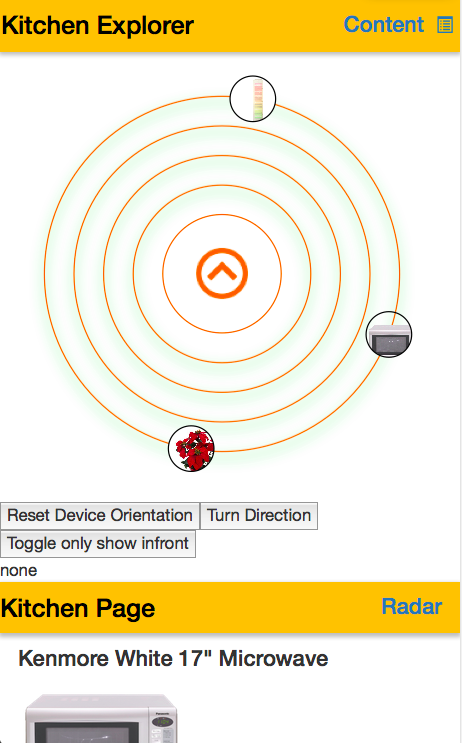

# IoT Explorer Compass

The image below shows a screenshots of the radar. The design is chosen to allow the mapping between real-world and flat representation to correspond to the users expectation. We chose a non-intrusive way to avoid cluttering the screen too much. When browsing, the circle in the center of the radar is filled with the icon of the thing currently under the reticule.

## Demo

A demo featuring several things deployed in our livinglab is available [HERE](http://frostyandy2k.github.io/iot-compass/examples/livinglab.html).

Please note that due to improper rendering support for SVGs in current WebKit browsers the demo may lag significantly. For the best experience, Firefox mobile is recommended.
We are working to fix this issue by replacing the computation intensive svg fill operations by simple images until the software support reaches an acceptable level.